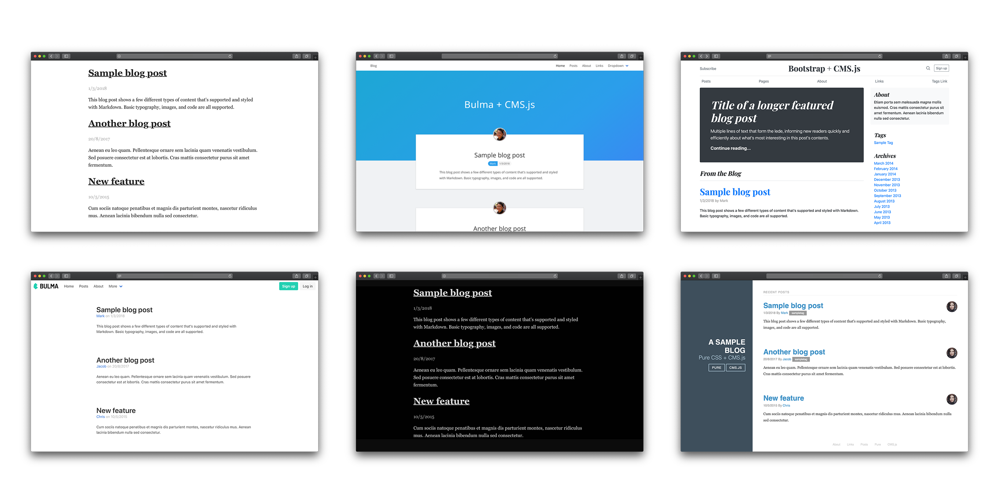

CMS.js is fully **C**lient-side, JavaScript **M**arkdown **S**ite generator in the spirit of [Jekyll](https://github.com/jekyll/jekyll) that uses plain ol' HTML, CSS and JavaScript to generate your website. CMS.js is like a file-based CMS.
It takes your content, renders Markdown and delivers a complete website in Single-Page App fashion...without the aid of server-side scripting (no Node.js, PHP, Ruby, etc.).

## New Features in Version 2.0

* Zero dependencies
* Abstract types
* Custom Templates
* Search, Filtering, Tagging and Sorting
* Github & Server Mode
* Extendable Markdown Renderer and Plugins
* Super small footprint - 8kb minified

## Demo

Check out a working [demo here](http://chrisdiana.github.io/cms.js/demo)

## Quick Start

CMS.js supports two website modes, Github and Server. Host your website on Github using Github Pages (similar to Jekyll) or use Server mode if you choose to self host your content. Learn more about server mode and setup [here](https://github.com/chrisdiana/cms.js/wiki/Server-Mode).

1. Clone the starter repo: `git clone https://github.com/chrisdiana/cms.js-starter.git` or download the [latest release](https://github.com/chrisdiana/cms.js/releases/latest)
2. Configure `js/config.js` to your liking
3. Make sure to set your Github settings in `js/config.js` if using Github mode
4. If using Github mode, create a new branch from your master or working branch called `gh-pages` (Github's default branch for hosting)
5. Visit your site!

## Themes

Try out CMS.js with a variety of popular CSS frameworks such as Bootstrap, Foundation, and Bulma. Check out all the themes [available here](https://github.com/chrisdiana/cms.js-themes).

## How it works

**Github Mode**

In Github mode, CMS.js uses the Github API to get the content of your repo and serve them as a full website.

**Server Mode**

In Server mode, CMS.js takes advantage of the Server's Directory Indexing feature. By allowing indexes, CMS.js sends an AJAX call to your specified folders and looks for Markdown or HTML files.
After they are found, it takes care of everything else and delivers a full website.

## Migration from Jekyll

**Importing Posts**

Once CMS.js is installed and running, simply copy all of your posts from your Jekyll project's `_post` folder to your designated CMS.js posts folder.

**Importing Pages**

Copy all of your Markdown pages from your Jekyll projects root folder into your designated CMS.js pages folder.

## Coming soon!

* Pagination
* Template caching
* Loader
* CLI Utilities

## Thanks!

* [Poole](https://github.com/poole/poole) (*Default Theme*)

## Contributing

All forms of contribution are welcome: bug reports, bug fixes, pull requests and simple suggestions. If you do wish to contribute, please run `npm run lint` before submitting a PR. Thanks!

## List of contributors

You can find the list of contributors [here](https://github.com/chrisdiana/cms.js/graphs/contributors).
